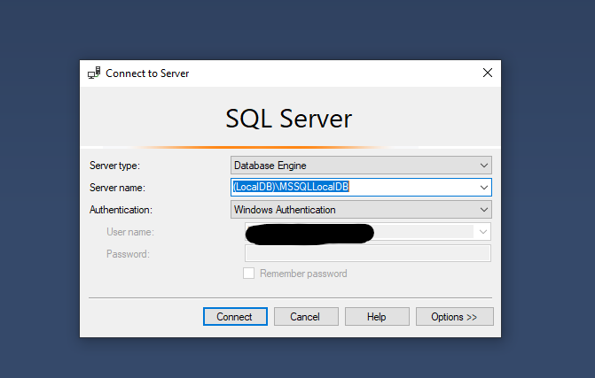
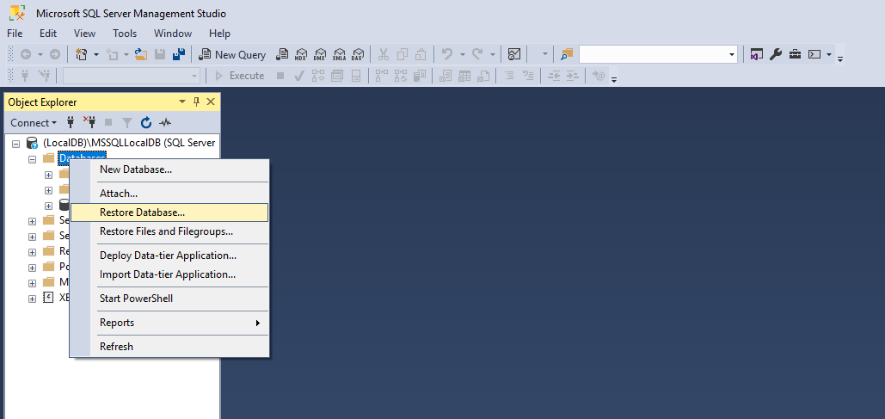
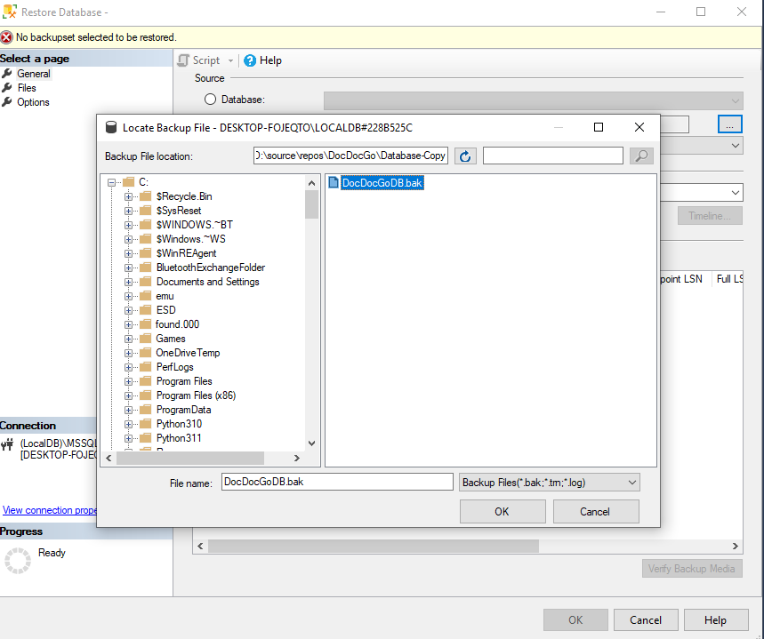
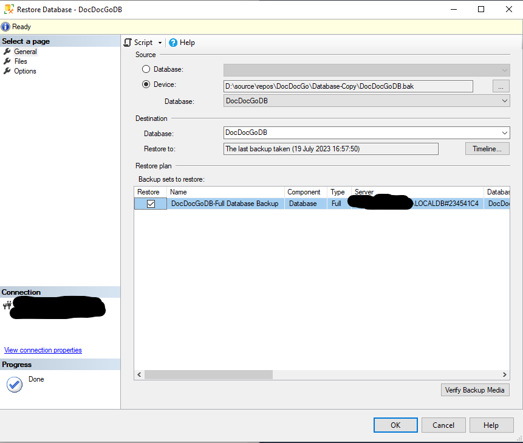

<h1 align="center">DocDocGo</h3>
<a id="top"></a>

<!-- PROJECT LOGO -->
<br />
<div align="center">
  
</div>


DocDocGo is a Hospital Management System that is a web-based application designed to streamline and automate the administrative and operational processes of a hospital or medical facility. This system aims to enhance efficiency, improve patient care, and provide a user-friendly interface for staff members and administrators.

<details>
  <summary>Table of Contents</summary>
  <ol>
    <li>
      <a href="#introduction">Introduction</a>
        <li>
		<a href="#features">Features</a>
		</li>
	     <li>
		<a href="#technologies-used">Tech Stack</a>
		</li>
		<li>
		<a href="#installation">Installation</a>
		</li>
		<li>
		<a href="#usage">Usage</a>
		</li>
		<li>
		<a href="#license">License</a>
    </li>
  </ol>
</details>

## Introduction

As part of my university assignment, I developed DocDocGo to demonstrate my understanding of software engineering practices and the full appropriate practices of the Software Development LifeCycle (SDLC). 

The system offers a comprehensive range of features to manage patient records, appointments, medical staff, and other essential aspects for hospital operations.

One of the noteworthy additions to the system is the integration of ASP.NET Core Identity, which enhances the system's administrative security by managing users, account lockouts, role assignments, along with other authentication and authorization related features.


## Features

###  Patient Management:
- Register and manage patient information.
- Assign unique patient IDs for easy identification.
- Track their appointments, personal information and reports associated with them.

### Appointment Scheduling:
- Enable staff to book appointments with a variety of different scenarios with patients online.
- Provide staff with a calendar view of their appointments.
- Allow rescheduling and full cancellation of appointments.

### Staff Management:
- Maintain a database of doctors, nurses, and other personnel.
-Track their contact information, roles, et cetera via an administrative portal.

### Administrative Security:
- Manage users with features from ASP.NET core identity, such as locking out users out of their accounts, 
- reassigning roles for personnel and resetting passwords to enhance security.

### Reporting And Exporting:
- Allows for the generation of customizable reports based off of a wide variety of expected patient information
- Save template reports for ease of use and future reference.
- Export to *.xlsx format.

## Technologies Used

- Frontend: HTML, CSS, JavaScript, JQuery, Razor Pages
- Backend: ASP.NET Core
- Database: SQL Server
- Additional Libraries/Tools: fullcalendar.io, Entity Framework Core, Bootstrap
	

## Installation

   1. Clone this repository to your local machine.

  ```sh
  git clone https://github.com/Wraami/DocDocGo.git
```

Proceed to restore the database using the instructions in the next section.


### Restore the Database
   Set up the database (SQL Server) using SQL Server Management Studio (SSMS).

Connect to the MSSQLLocalDB or a local server instance you have specified.
	

Navigate to "Object Explorer":

In SSMS, locate the "Object Explorer" window.

Right-Click "Databases" Folder:

Right-click on the "Databases" folder in Object Explorer.

Select "Restore Database":

From the context menu, choose "Restore Database..."


    Choose Source Database:

In the "Restore Database" window, select "Device" as the source and click on the ellipsis button (...).

Select Backup File:
    Press Add and browse for the .bak file in the repository you have cloned, in this case, it's contained within the Database-Copy Folder.
	


Press OK.

You now should see the following screen:



Click the "OK" button to initiate the database restore process. The restore progress will be displayed in the Messages tab.


### Verify the Restore:

Once the restore process is complete, refresh the server instance and expand the "Databases" folder in Object Explorer to ensure that the new 'DocDocGoDB' database appears.

If you changed the DB name on restore, be sure to update this in the 'HospitalManagementSQLConnection' connection string of the project contained within the appsettings.json.

You should now have successfully restored the database from the .bak file, and the DocDocGo application should be able to start and use the restored database for its operations.	
	
## Usage

Access the application by navigating to the localhost in your web browser.

Use the provided login credentials to access different roles (admin, staff).
	
### Administrator:
Email: sarah-admin@hospitaltrust.com

Password: Password123-_
	
### Staff member:
Email: pavel.sanjah-staff@hospitaltrust.com

Password: Password123-_


## License

DocDocGo is open-source software licensed under the [MIT License](LICENSE).

<p align="right">(<a href="#top">back to top</a>)</p>
